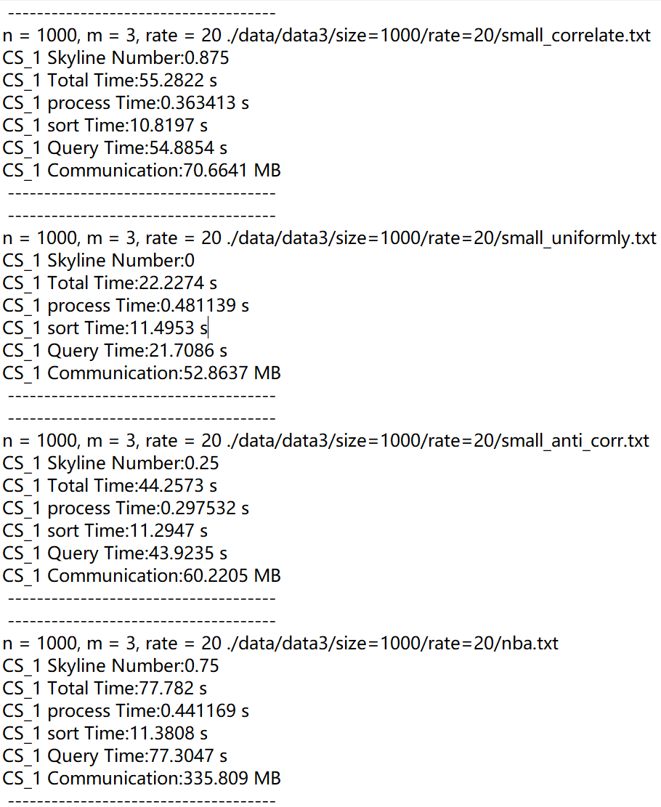

# ISky
The source code is located in ./test/test_ring_isky.cpp

## Introduction:

run the code:

`cd ./build/`

`cmake -DCMAKE_INSTALL_PREFIX=./install .. -DBUILD_TESTS=ON -DBUILD_NETWORKS=ON`

`cmake --build . --target install --parallel`

the "isky-OT.o" file is generated. 

Please move to the "run" file:

`cd /build/bin/`

To test the files, we prepared the relevant executables, where "isky-OT-B" stands for basic filtering, "isky-OT-F" for fully filtering, where "T" for threads and "Re" for extensions. 
Moreover, we construct shell files where: 

1. Pname: "i" denotes the dataset (0 to 3, representing four datasets: corr, anti, inde, and nba),
2. Pdim: "k" denotes the dimension (0 to 4, representing 2 to 6 dimensions),
3. Psize: "j" denotes the size (0 to 5, representing (1000, 3000, 5000, 7000, 9000, and 11000)),
4. Prate: "r" denotes the rate (0 to 4, representing 10% to 50% missing rate).

## Run test example:

For example, run the command.

`nohup ./run.sh >output.txt 2>&1 &`

, the whole console output is stored in "output.txt".

## Other test

You can also be executed individually with the following command:

`./isky-OT-BT r=1 p=12000 Pdim=$k Pname=$i Psize=0 Prate=1 Pthread=1 & ./isky-OT-BT r=2 p=12000 Pdim=$k Pname=$i Psize=0 Prate=1 Pthread=1`

the test result is generated in the following file:

./test/out_1_T.txt, ./test/out_2_T.txt

The Skyline Number, Query Time, Query Time, and Communication are printed. For example:

